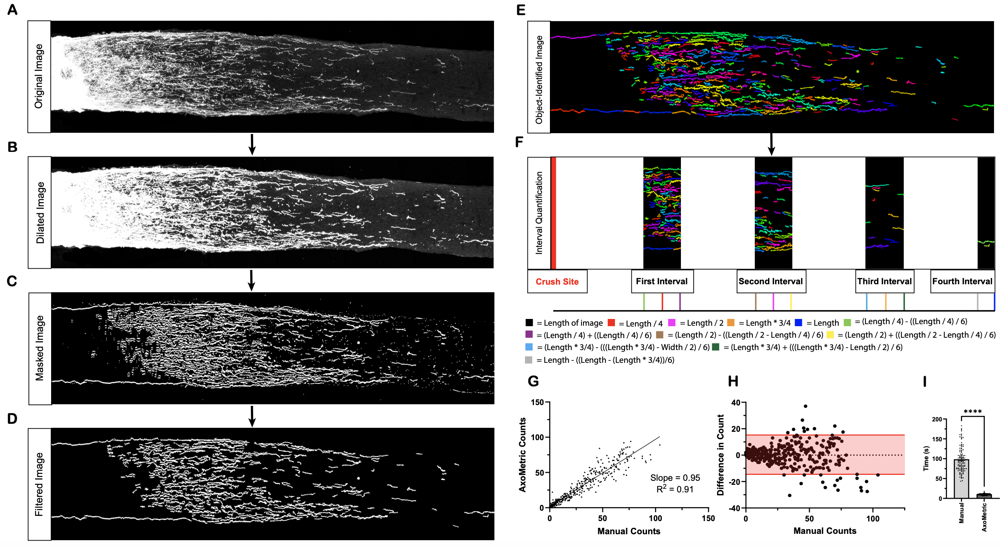
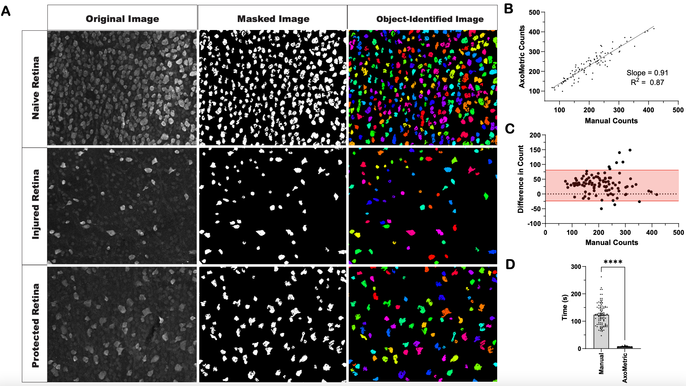

# 
**AxoMetric**

Welcome to AxoMetric: An automatic interval-based quantification platform optimized for axon, mean fluorescence intensity, and cell body quantification. The purpose of this software is to create a tool for researchers to analyze tissue staining within distance intervals in an unbiased, consistent, and accessible manner. This platform will allow users to normalize tissue staining to tissue width based on cellular nuclear staining. This software was developed based on mouse optic and sciatic nerve longitudinal sections, however this may be applicable to other species / types of sections. The platform also includes a tool to measure the number of retinal ganglion cells (RGCs) in retina flatmount images of Rbpms-stained retinas.

 

The platform is divided into three parts: axon (CTB) quantification, mean fluorescence intensity (MFI) quantification, and retinal ganglion cell (Rbpms) quantification.

 

#### **Axon Quantification**

**Total Number of Axons** - Measure the total number of axons in an image at 4 separate intervals from the injury site. 

*Developed based on 20x images of mouse optic nerves stained with cholera toxin subunit B (CTB).

 

**Normalized Number of Axons** - Measure the total number of axons in an image at 4 separate intervals from the injury site, and then normalize the total number of axons by the nerve width (calculated from nuclear stained image pixel height in inches) at each of the 4 intervals, represented by axons / um of nerve width. 

}
*Developed based on 20x images of mouse optic nerves stained with cholera toxin subunit B (CTB) & Hoechst.

 

**Multiple File Quantification (Total #)** - For multiple image files simultaneously, measure the total number of axons in an image at 4 separate intervals from the injury site. 

 

#### **MFI Quantification**  

**Total MFI** - Measure the mean fluorescence intensity (MFI) of an image at 4 separate intervals from the injury site.

*Developed based on 20x images of mouse sciatic nerves stained with Stathmin-2.

 

**Normalized MFI** - Measure the MFI in an image at 4 separate intervals from the injury site, and then normalize the MFI by the nerve width (calculated from nuclear stained image and pixel height in inches) at each of the 4 intervals, represented by MFI / um of nerve width. 

 

#### **RGC Quantification**

**Single File Quantification** - Measure the number of Rbpms+ cells in a field-of-view of one image file.

**Multiple File Quantification** - For multiple image files simultaneously, measure the number of Rbpms+ cells in a field-of-view.

 

*Developed based on 20x images of mouse retinas stained with Rbpms.

 

#### **Developer** 

 

Matthew Finneran, Giger Laboratory

Neuroscience Graduate Program, University of Michigan Medical School 

Department of Cellular and Developmental Biology

University of Michigan Ann Arbor, MI

2025

 

#### **Acknowledgements** 

*Figures created with Biorender.com

*Thank you to Craig Johnson, Bioinformatician of the Cellular and Developmental Biology Department at the University of Michigan, for his help with AxoMetric.

*Thank you to Dr. Larry Benowitz for his feedback and support in the development of this tool.

*Thank you to our support from these funding sources: National Institutes of Health (NIH) Ruth L. Kirschstein National Research Service Award (1F31EY036280-01), the Dr. Miriam and Sheldon G. Adelson Medical Research Foundation, the Stein Innovation Award for Research to Prevent Blindness, and the Department of Health and Human Services Advanced Research Projects Agency for Health (ARPA-H).
 

